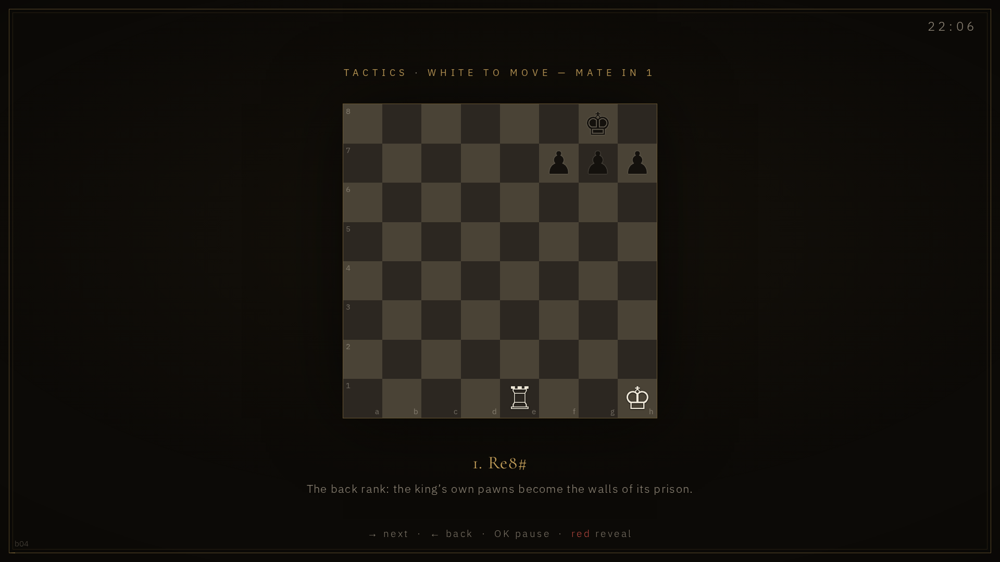
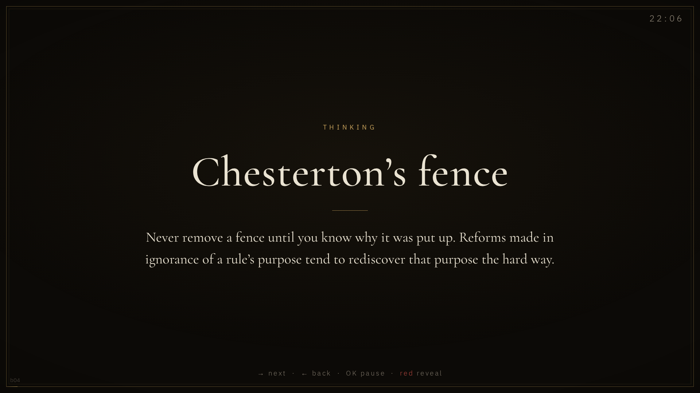

# Night Gallery


An ambient learning canvas for Samsung Tizen TVs. It shows one museum-style
full-screen card at a time — a chess puzzle whose solution reveals after four
minutes, or a concept card from a 585-card library — with quiet ambient light
interludes between them. It teaches in glances, runs in the background
without asking for attention, and is styled to make the room it's in look
better, not busier.




## Website

- [English](https://cocodedk.github.io/night-gallery/)
- [فارسی (Persian)](https://cocodedk.github.io/night-gallery/fa/)
- [Live demo in your browser](https://cocodedk.github.io/night-gallery/demo/)

## Features

- **Glanceable cards.** One card fills the screen at a time — no menus, no
  clutter, nothing competing for attention while you're not looking at it.
- **585 concept cards across 14 tags**: Systems, Electronics, Chess,
  Geography, Dansk, Farsi, Latin, Sun Tzu, Math, Physics, Design, History,
  Security, Thinking — plus 7 verified checkmate patterns for the puzzle
  channel.
- **Offline by design.** The whole app, including fonts, ships inside a
  single signed `.wgt`. It runs with the TV's network unplugged.
- **Museum aesthetic.** Deep warm black, a gilded hairline frame, large serif
  type readable from across the room.
- **Bundled fonts**, including Persian (Vazirmatn) and dedicated chess piece
  glyphs, so nothing depends on a font the TV happens to have installed.
- **On-device debug overlay** (BLUE key) reporting build stamp, font load
  results, frame rate, and the last keys received — built for a device with
  no remote DevTools.

Remote mapping:

| Action | TV remote | Desktop key |
|---|---|---|
| Next / previous card | Arrow right / left | → / ← |
| Pause / resume | OK | Space |
| Reveal puzzle solution | RED | S |
| Toggle debug overlay | BLUE | D |
| Exit | Back, twice | — |

## Try it

Open the [live demo](https://cocodedk.github.io/night-gallery/demo/), or
clone the repo and open `tizen/index.html` in any browser — no build step,
no server. Keys: → / ← next/back, Space or OK pause, S or RED reveal the
puzzle solution, D or BLUE toggle the debug overlay.

## Put it on a TV

Prerequisites: the
[Tizen Studio CLI](https://developer.samsung.com/smarttv/develop/getting-started/setting-up-sdk/installing-tv-sdk.html)
with a signing profile, and a TV in developer mode.

There's nothing to install for the app itself — it has zero runtime
dependencies. To sideload it:

1. On the TV: Apps panel → type `12345` → toggle Developer mode on → set
   this machine's IP as the host → reboot the TV.
2. From this repo: `npm run install-tv`. It auto-discovers the TV on your
   LAN, packages and signs the widget, installs it, and launches it. Override
   discovery with `--ip`, the signing profile with `--profile`, or the
   Tizen app id with `--app-id`.

No prebuilt `.wgt` is published in releases: Tizen sideloading requires
signing against your own certificate and your own TV, so a prebuilt package
would not install anywhere but the one it was built for.

## Development

```bash
npm run check          # smoke + unit tests + Chromium-76 guard + Playwright e2e
npm run content-index  # regenerate docs/CONTENT-INDEX.md
bash scripts/install-hooks.sh   # one-time: activate git hooks for this clone
```

`npm run check` runs four gates: a syntax smoke pass over every `tizen/js`
file, unit tests for the pure logic, a static guard that fails on any
Chromium-76-unsupported CSS/JS feature, and a Playwright end-to-end pass at
1920×1080.

Adding a card is a one-line addition to the matching tag file under
`tizen/js/content/<tag>.js`. See `docs/CONTENT-INDEX.md` for every existing
card — it's generated, so run `npm run content-index` after adding one.

## Architecture

```
tizen/
  index.html
  js/            rotation engine, key handling, rendering — one concern
                 per file, ≤200 lines each
  js/content/    one file per tag (concept card data)
  css/           layout, card styles, debug overlay
  fonts/         bundled woff2 (see fonts/LICENSES.md)
scripts/         guard, packaging, install, content-index tooling
tests/           unit tests + Playwright e2e
```

Every card — puzzle, concept, or ambient — is the same small contract:
`{ node, duration, onEnter, onExit, reveal }`. The rotation engine that walks
through them is pure and takes an injected clock, so the whole sequencing
logic is testable headless in Node, with no browser and no TV required.

## Author

**Babak Bandpey** — [cocode.dk](https://cocode.dk) |
[LinkedIn](https://linkedin.com/in/babakbandpey) |
[GitHub](https://github.com/cocodedk)

## License

Apache-2.0 | © 2026 [Cocode](https://cocode.dk) | Created by
[Babak Bandpey](https://linkedin.com/in/babakbandpey)

Bundled fonts carry their own licenses — see
[`tizen/fonts/LICENSES.md`](tizen/fonts/LICENSES.md).
